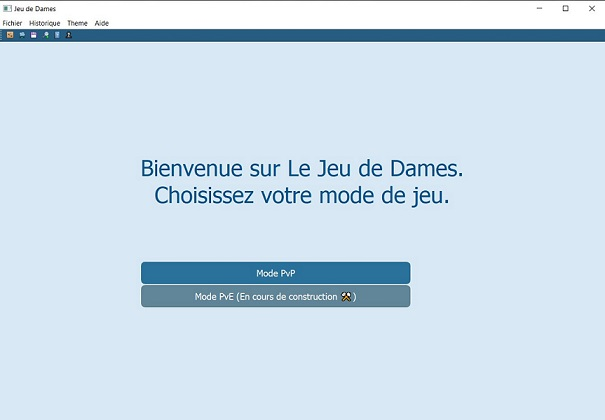
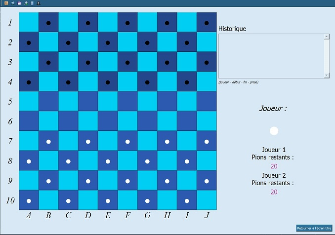
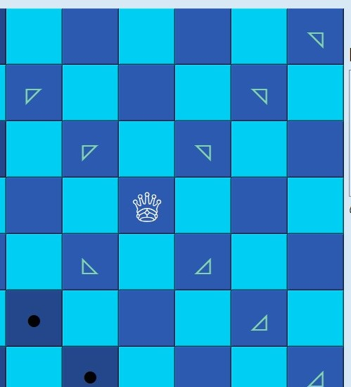

### Checkers
A game of Checkers

## Requirement
Library PyQt5

## How to play
1.  Click on the "Mode PvP" button to play against another humman player.

   

2.  First player (White) take turns moving one checker per turn. A piece can move diagonally towards the opposing team. It cannot move backwards towards it own home space. Click on piece of your team to select a it, click on an arrow then displayed to confirm where you wish to play.

3. The second player does the same.
4. Capturing when possible is mandatory: ALL pieces that cannot be captured are darkened leaving you the possibility of capturing an opponent's pawn

5. When a piece reaches the end of the opponent's board, the pawn automatically becomes a queen. A queen has a better range of motion. (Pawns are not blocked when she can capture).

6.  Multi-capture is not implemented.

## How to win
First player who capture all opponents pawns win the game.

## How to run
Run the *Jeu_de_Dames.py* file along with all other files in the same folder.

## Possible improvements
- Implement Multi-capture
- Timer for each turn
- PvE mode

## Context
This project was created as part of my studies in the 2nd year of my engineer school ESME Sudria.
